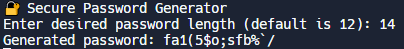

# 🔐 Cybersecurity Labs & Tools

Welcome to my cybersecurity lab repo.  
This is where I document tools, scripts, and learning projects as I study cybersecurity hands-on.

## 🧰 What You’ll Find Here
- Bash and Python security tools
- Writeups from TryHackMe or CTF exercises
- Command references and quick notes
- Projects like password generators, scanners, log parsers, etc.

## 🧠 Goal
Build practical cybersecurity skills that I can demonstrate to employers  
and use in real-world environments — from automation to ethical hacking.

> This repo evolves with my knowledge. Stay tuned.

## 🖼️ Demo Screenshot

Here’s what it looks like when the password generator runs:

